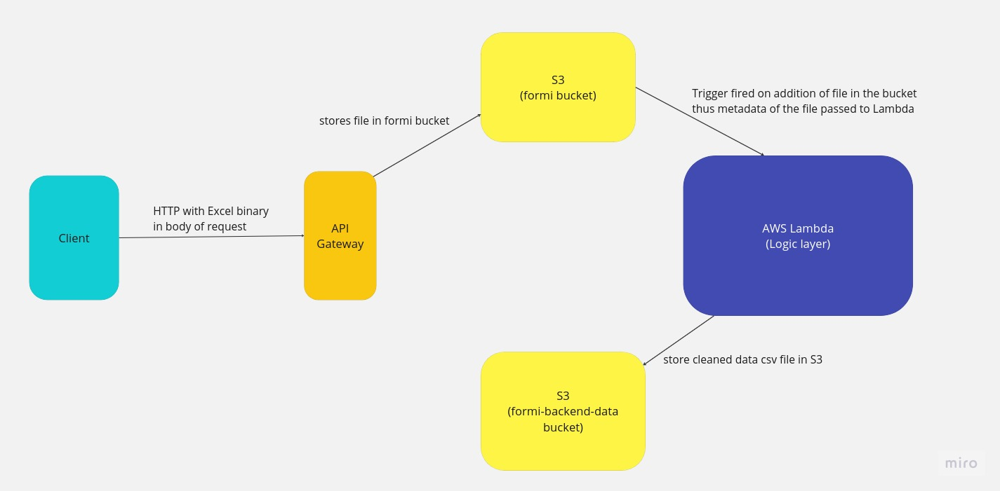

# FORMI Hackathon Project:
This project is a result of hackathon conducted by Formi on 18th September, 2023. I developed this end-to-end in 15 hours from 12am to 3pm. 

To know about the problem statement, do check out: https://doc.clickup.com/9002068787/p/h/8c91atk-26544/422497f3a492196/8c91atk-26564  

# Clean Customer Data API
This repository contains the source code of an API that accepts the unorganized data of users of Formi's clients in the 
form of an Excel file and cleans it in a way that it can be mapped to Formi's backend in an automated fashion. 

The resulting CSV file gets stored in a S3 bucket which can be accessed by Formi's backend if the need comes.

## Technologies Used:  
Python3, pandas, openpyxl

## AWS Services Used: 
API Gateway, Lambda, S3, CloudWatch  

## API Endpoints:

**PUT**   _https://jvt1ypuao4.execute-api.ap-south-1.amazonaws.com/dev/<bucket_name>/<excel_file_name>_ 

You need to attach the concerned Excel File in binary format in the Body of the PUT request.

<bucket_name> needs to be replaced by the S3 bucket where a trigger is set up to run the Lambda function to run the 
backend code to clean the data and save it in another secure S3 bucket.

<excel_file_name> needs to be replaced by the name with which you want to save your file in <bucket_name>

## Reference videos: 

Demo video showing how the API works end-to-end: https://drive.google.com/file/d/1x1GaFO746s2mP6k1ntLkBY69TtyDKoyY/view?usp=sharing

Video discussing Architecture and Code: https://drive.google.com/file/d/1x1GaFO746s2mP6k1ntLkBY69TtyDKoyY/view?usp=sharing

Thanks to Formi and the team for giving me an opportunity to push my limits!